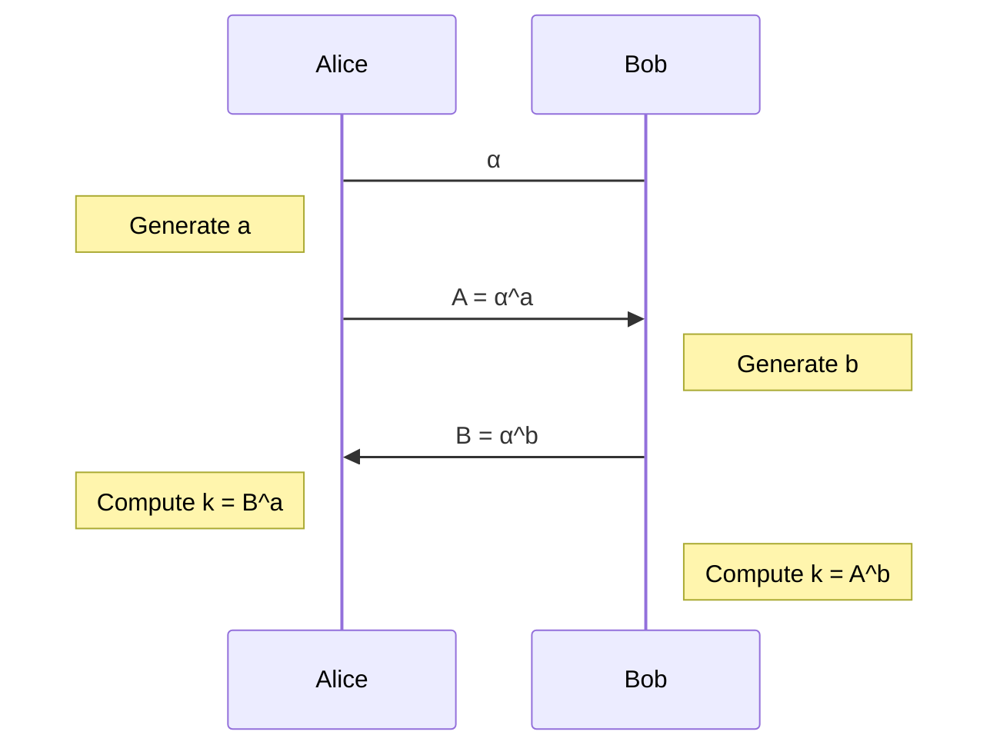

# Cryptography and computer security - Tutorial 20.10.2020

---

## Algorithms with numbers

### Exercise 1

Calculate the following using the square-and-multiply algorithm:

1. <i>$5^{13} \bmod{61}$</i>
2. <i>$10^{34} \bmod{97}$</i>

---

### Exercise 2

Calculate the following using the Euclidean algorithm:

1. <i>$\gcd(264, 210)$</i>
2. <i>$\gcd(975, 124)$</i>
3. <i>$\gcd(89, 55)$</i>

---

### Exercise 3

Calculate the following using the extended Euclidean algorithm:

1. <i>$3^{-1} \bmod{17}$</i>
2. <i>$13^{-1} \bmod{61}$</i>
3. <i>$10^{-1} \bmod{97}$</i>

---

### Exercise 4

Recall that in the Diffie-Hellman protocol, Alice and Bob first agree on a group element <i>$\alpha$</i>, and then generate secret integers <i>$a$</i> and <i>$b$</i>, respectively, which they use to compute <i>$\alpha^a$</i> and <i>$\alpha^b$</i>. After exchanging these values they can compute the shared secret <i>$\alpha^{ab}$</i>. Here, we used the multiplicative notation.

1. Suppose that the the group they have used is <i>$(\mathbb{Z}_n, +)$</i> for some integer <i>$n$</i>. Can an eavesdropper construct the shared secret from the publicly known data?
2. Suppose that the the group they have used is <i>$(\mathbb{Z}^*_p, *)$</i> for some prime number <i>$p$</i>. Does a similar approach work?
3. Check that the groups <i>$(\mathbb{Z}_{16}, +)$</i> and <i>$(\mathbb{Z}^*_{17}, \cdot)$</i> have the same structure -- they are both cyclic groups of the same size. Why is this true?
