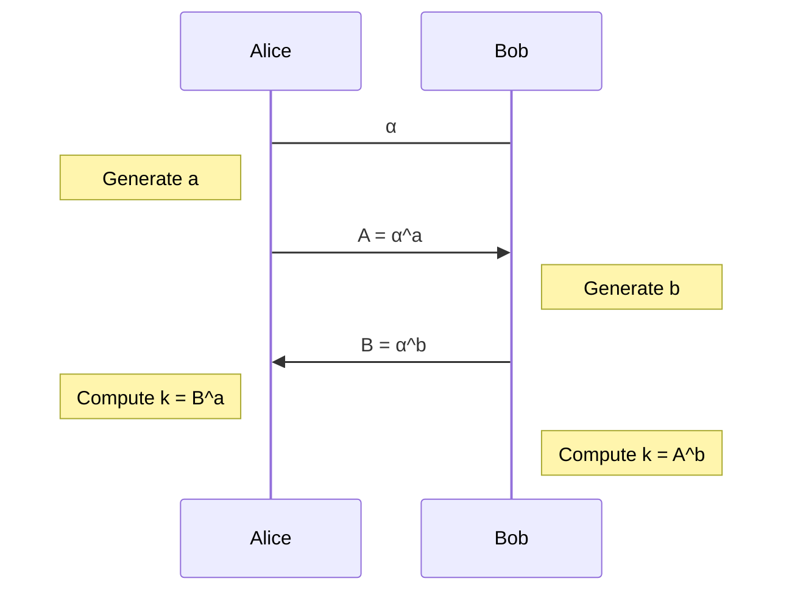

# Cryptography and computer security - Tutorial 20.10.2020

---

## Algorithms with numbers

### Exercise 1

Calculate the following using the square-and-multiply algorithm:

1. <i>$5^{13} \bmod{61}$</i>
2. <i>$10^{34} \bmod{97}$</i>

----

1. <i>$13 = 8 + 4 + 1 = 1101_2$</i>

   | bit | square | multiply |
   | --- | ------ | -------- |
   | 1   | <i>$5^0 = 1$</i> | <i>$5^1 = 5$</i> |
   | 1   | <i>$5^2 = 25$</i> | <i>$5^3 = 125 = 3$</i> |
   | 0   | <i>$5^6 = 9$</i> | 
   | 1   | <i>$5^{12} = 81 = 20$</i> | <i>$5^{13} = 100 = 39$</i>

   <i>$5^{13} \equiv 39 \pmod{61}$</i>

2. <i>$34 = 32 + 2 = 100010_2$</i>

   | bit | square | multiply |
   | --- | ------ | -------- |
   | 1   | <i>$1$</i>    | <i>$10$</i> |
   | 0   | <i>$3$</i>
   | 0   | <i>$9$</i>
   | 0   | <i>$81 = -16$</i>
   | 1   | <i>$16^2 = 256 = 62$</i> | <i>$620 = 38$</i>
   | 0   | <i>$86$</i>

   ```
    38 * 38 = 1444 = 14 * (97 + 3) + 44 = 42 + 44 = 86
   114
    304
   1444
   ```

   <i>$10^{34} \equiv 86 \pmod{97}$</i>

---

### Exercise 2

Calculate the following using the Euclidean algorithm:

1. <i>$\gcd(264, 210)$</i>
2. <i>$\gcd(975, 124)$</i>
3. <i>$\gcd(89, 55)$</i>

----

```
a, b, c = a mod b        a = k*b + c
b, c, d = b mod c
...
x, y, z = x mod y = 0
gcd(a, b) = y
```

1. | <i>$a$</i> | <i>$b$</i> | <i>$c$</i> |
   | --- | --- | --- |
   | 264 | 210 | 54  |
   | 210 | 54  | 48  |
   | 54  | 48  | 6   |
   | 48  | 6   | 0   |

   <i>$\gcd(264, 210) = 6$</i>

2. | <i>$a$</i> | <i>$b$</i> | <i>$c$</i> | <i>$a = kb + c$</i> |
   | --- | --- | --- | ------------ |
   | 975 | 124 | 107 | <i>$975 = 7 \cdot 124 + 107$</i> |
   | 124 | 107 | 17  | <i>$124 = 1 \cdot 107 + 17$</i> |
   | 107 | 17  | 5   | <i>$107 = 6 \cdot 17 + 5$</i> |
   | 17  | 5   | 2   | <i>$17 = 3 \cdot 5 + 2$</i> |
   | 5   | 2   | 1   | <i>$5 = 2 \cdot 2 + 1$</i> |
   | 2   | 1   | 0   | <i>$2 = 2 \cdot 1 + 0$</i> |

   <i>$\gcd(975, 124) = 1$</i>, <i>$975 \bot 124$</i> (coprime)

3. | <i>$a$</i> | <i>$b$</i> | <i>$c$</i> | <i>$a = kb + c$</i> |
   | --- | --- | --- | ------------ |
   | 89  | 55  | 34  | <i>$89 = 1 \cdot 55 + 34$</i> |
   | 55  | 34  | 21  | <i>$55 = 1 \cdot 34 + 21$</i> |
   | 34  | 21  | 13  | <i>$34 = 1 \cdot 21 + 13$</i> |
   | 21  | 13  | 8   | <i>$21 = 1 \cdot 13 + 8$</i> |
   | 13  | 8   | 5   | <i>$13 = 1 \cdot 8 + 5$</i> |
   | 8   | 5   | 3   | <i>$8 = 1 \cdot 5 + 3$</i> |
   | 5   | 3   | 2   | <i>$5 = 1 \cdot 3 + 2$</i> |
   | 3   | 2   | 1   | <i>$3 = 1 \cdot 2 + 1$</i> |

   <i>$\gcd(89, 55) = 1$</i>

---

### Exercise 3

Calculate the following using the extended Euclidean algorithm:

1. <i>$3^{-1} \bmod{17}$</i>
2. <i>$13^{-1} \bmod{61}$</i>
3. <i>$10^{-1} \bmod{97}$</i>

----

```
a = 1*a + 0*b    a = k*b + c    c = a - k*b
b = 0*a + 1*b    b = l*c + d    d = b - l*c
c = (1 - k*0)*a + (0 - k*1)*b
d = ... * a + ... * b
...
1 = r*a + s*b
a^-1 mod b = r
b^-1 mod a = s
```

1. | <i>$k$</i> | <i>$a$</i> | <i>$r$</i> | <i>$s$</i> |
   | --- | --- | --- | --- |
   |     | 17  | 1   | 0   |
   |     | 3   | 0   | 1   |
   | 5   | 2   | 1   | -5  |
   | 1   | 1   | -1  | 6   |

   * <i>$1 = -1 \cdot 17 + 6 \cdot 3$</i>
   * <i>$1 \equiv 6 \cdot 3 \pmod{17}$</i>
   * <i>$3^{-1} \bmod{17} = 6$</i>
   * <i>$1 \equiv -1 \cdot 17 \pmod{3}$</i>
   * <i>$2^{-1} \bmod{3} = 17^{-1} \bmod{3} = -1 \bmod{3} = 2$</i>

2. | <i>$k$</i> | <i>$a$</i> | <i>$s$</i> |
   | --- | --- | --- |
   |     | 61  | 0   |
   |     | 13  | 1   |
   | 4   | 9   | -4  |
   | 1   | 4   | 5   |
   | 2   | 1   | -14 |

   <i>$13^{-1} \bmod{61} = 61 - 14 = 47$</i>

3. | <i>$k$</i> | <i>$a$</i> | <i>$s$</i> |
   | --- | --- | --- |
   |     | 97  | 0   |
   |     | 10  | 1   |
   | 9   | 7   | -9  |
   | 1   | 3   | 10  |
   | 2   | 1   | -29 |

   <i>$10^{-1} \bmod{97} = 68$</i>

---

### Exercise 4

Recall that in the Diffie-Hellman protocol, Alice and Bob first agree on a group element <i>$\alpha$</i>, and then generate secret integers <i>$a$</i> and <i>$b$</i>, respectively, which they use to compute <i>$\alpha^a$</i> and <i>$\alpha^b$</i>. After exchanging these values they can compute the shared secret <i>$\alpha^{ab}$</i>. Here, we used the multiplicative notation.



1. Suppose that the the group they have used is <i>$(\mathbb{Z}_n, +)$</i> for some integer <i>$n$</i>. Can an eavesdropper construct the shared secret from the publicly known data?
2. Suppose that the the group they have used is <i>$(\mathbb{Z}^*_p, *)$</i> for some prime number <i>$p$</i>. Does a similar approach work?
3. Check that the groups <i>$(\mathbb{Z}_{16}, +)$</i> and <i>$(\mathbb{Z}^*_{17}, *)$</i> have the same structure -- they are both cyclic groups of the same size. Why is this true?

----

Group <i>$(G, \circ)$</i>
* closed for <i>$\circ$</i>: <i>$\forall a, b \in G: a \circ b \in G$</i>
* associativity: <i>$\forall a, b, c \in G: (a \circ b) \circ c = a \circ (b \circ c)$</i>
* unit: <i>$\exists e \in G \ \forall a \in G: e \circ a = a \circ e = a$</i>
* inverse: <i>$\forall a \in G \ \exists b \in G: a \circ b = b \circ a = e$</i>, where <i>$e$</i> is the unit

<i>$\alpha^a = \alpha \circ \alpha \circ \dots \circ \alpha$</i> (<i>$a$</i> times)

Examples: <i>$(\mathbb{Z}_n, +_n)$</i>, <i>$(\mathbb{Z}_p^*, *)$</i>

1. * <i>$A = a \cdot \alpha \bmod{n}$</i>, <i>$B = b \cdot \alpha \bmod{n}$</i>
   * <i>$a = A \cdot \alpha^{-1} \bmod{n}$</i>, <i>$b = B \cdot \alpha^{-1} \bmod{n}$</i>i>
   * <i>$k = ab \cdot \alpha$</i>

2. The attacker would need to compute <i>$a = \log_\alpha A$</i> in <i>$\mathbb{Z}_p^*$</i>, which is thought to be a **hard problem**.
