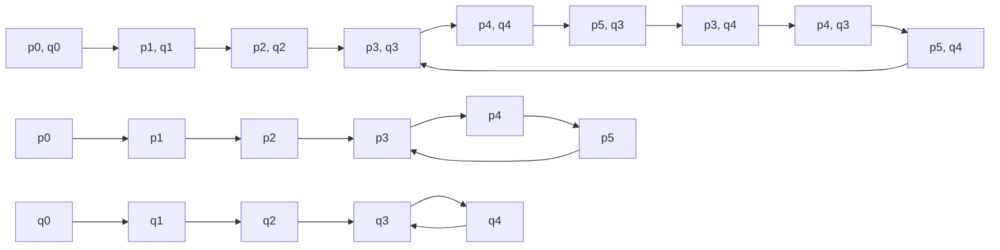

# Cryptography and computer security - Tutorial 1.12.2020

---

## Primality testing

* Input: odd integer $n$.
* Output: **Composite** (*yes*) or **Probable prime** (*no*).

### Solovay-Strassen algorithm

1. Choose $a \stackrel{R}{\in} \mathbb{Z}_n \setminus \lbrace 0 \rbrace$. $O(\log n)$
2. Compute $x := \left( {a \over n} \right)$. $O(\log^3 n)$
3. If $x = 0$, then return **Composite**. $O(1)$
4. Compute $y := a^{(n-1)/2} \bmod{n}$. $O(\log^3 n)$
5. If $x \equiv y \pmod{n}$, then return **Probable prime**, else return **Composite**. $O(\log n)$

Time complexity: $O(\log^3 n)$

### Miller-Rabin algorithm

1. Write $n-1 = 2^k m$, where $m$ is odd. $O(\log n)$
2. Choose $a \stackrel{R}{\in} \mathbb{Z}_n \setminus \lbrace 0 \rbrace$. $O(\log n)$
3. Compute $b := a^m \bmod{n}$. $O(\log^3 n)$
4. If $b \equiv 1 \pmod{n}$, then return **Probable prime**. $O(1)$
5. Repeat $k$ times: $O(\log n)$ steps, total $O(\log^3 n)$
   1. If $b \equiv -1 \pmod{n}$, then return **Probable prime**. $O(\log n)$
   2. Compute $b := b^2 \bmod{n}$. $O(\log^2 n)$
6. Return **Composite**. $O(1)$

Time complexity: $O(\log^3 n)$

---

### Exercise 1

Show that the Solovay-Strassen and Miller-Rabin algorithms are yes-biased Monte Carlo algorithms (i.e., a *yes* answer is always correct).

----

* Solovay-Strassen:
    * if $n$ is prime, then $x \ne 0$ and $x \equiv y \pmod{n}$
    * therefore, the answer will always be **Probable prime**
* Miller-Rabin:
    * it returns **Composite** if $a^{2^i m} \not\equiv -1 \pmod{n}$ for all $i$
    * **Composite** is only returned for composite $n$

---

### Exercise 2

Show that the time complexity of the Solovay-Strassen and Miller-Rabin algorithms is $O(\log^3 n)$.

---

## Factorization

### Pollard $p-1$ algorithm

* Input: odd integer $n$, bound $B$.
* Output: factor $d$ or **failure**.

1. Set $a := 2$. $O(1)$
2. For $j = 2, 3, \dots, B$ do: $O(B)$ steps, total $O(B \log B \log^2 n)$
   1. Compute $a := a^j \bmod{n}$. $O(\log B \log^2 n)$
   2. Compute $d := \gcd(a-1, n)$. $O(\log^2 n)$
   3. If $1 < d < n$, then return $d$. $O(\log n)$
3. Return **failure**. $O(1)$

Say $n = \prod_{i=1}^t p_i$. If $(p_i-1) | B!$, then $2^{B!} \equiv 1 \pmod{p_i}$. Then $2^{B!} - 1 \bmod{n}$ is a multiple of $p_i$.

Assume $n = pq$ is a RSA modulus. We should choose the primes $p, q$ so that $p-1 = 2p'$, $q-1 = 2q'$, where $p', q'$ are prime numbers.
* Such primes $p, q$ are called **safe primes**.
* The primer $p', q'$ are called **Sophie Germain primes**.

Time complexity: $O(B \log B \log^2 n)$, to attack an arbitrary $n$: $O(\sqrt{n} \log^3 n)$

---

### Pollard $\rho$ algorithm

* Input: odd integer $n$, function $f : \mathbb{Z}_n \to \mathbb{Z}_n$.
* Output: factor $d$ or **failure**.

1. Choose $x \stackrel{R}{\in} \mathbb{Z}_n \setminus \lbrace 0 \rbrace$.
2. Compute $y := f(x)$.
3. Compute $d := \gcd(x-y, n)$.
4. While $d = 1$:
   1. Compute $x := f(x)$.
   2. Compute $y := f(f(y))$.
   3. Compute $d := \gcd(x-y, n)$.
5. If $d \ne n$, then return $d$, else return **failure**.

---

### Dixon's random squares algorithm

* Input: odd integer $n$, prime base $(b_j)_{j=1}^t$.
* Output: factor $d$ or **failure**.

1. Set $m := 0$.
2. Initialize a $m \times t$ matrix $A$ over integers.
3. While $A$ has rank $m$ in $\mathbb{Z}_2$:
    1. Choose $x \stackrel{R}{\in} \mathbb{Z}_n \setminus \lbrace 0 \rbrace$.
    2. If there exist integers $a_1, a_2, \dots a_t$ such that $x^2 \bmod n = \prod_{j=1}^t b_j^{a_j}$, then:
        1. Set $m := m+1$.
        2. Set $x_m := x$.
        3. Set $A_{mj} := a_j$ for $j = 1, 2, \dots, t$.
4. Find $r_1, r_2, \dots r_k$ such that the rows $A_{r_1}, A_{r_2}, \dots, A_{r_k}$ sum to a zero vector in $\mathbb{Z}_2$.
5. Compute $y := \prod_{i=1}^k x_{r_i}$.
6. Compute $z := \prod_{j=1}^t b_j^{\sum_{i=1}^k A_{r_i, j}/2}$.
7. Compute $d := \gcd(y-z, n)$.
8. If $1 < d < n$, then return $d$, else return **failure**.

---

### Exercise 3

Prove the correctness of the Pollard $p-1$ algorithm.

---

### Exercise 4

Determine the time complexity of the Pollard $p-1$ algorithm.

---

### Exercise 5

Using various choices for the bound $B$, attempt to factor $262063$ and $9420457$ using the Pollard $p-1$ algorithm. How big does $B$ have to be in each case for the algorithm to be successful?

----

* [Computations](https://nbviewer.jupyter.org/github/jaanos/kirv/blob/master/notebooks/Factorization.ipynb#Pollard-$p-1$-algorithm)

---

### Exercise 6

Factor $n = 221$ using the Pollard $\rho$ algorithm with function $f(x) = (x^2 + 1) \bmod{221}$.

* [Computations](https://nbviewer.jupyter.org/github/jaanos/kirv/blob/master/notebooks/Factorization.ipynb#Pollard-$\rho$-algorithm)

---

### Exercise 7

Factor $n = 15770708441$ using Dixon's random squares algorithm with $b = 7$. Choose the integers $14056852462$, $9004436975$, $5286195500$, $11335959904$ and $7052612564$ as your random numbers.

* [Computations](https://nbviewer.jupyter.org/github/jaanos/kirv/blob/master/notebooks/Factorization.ipynb#Dixon's-random-squares-algorithm)